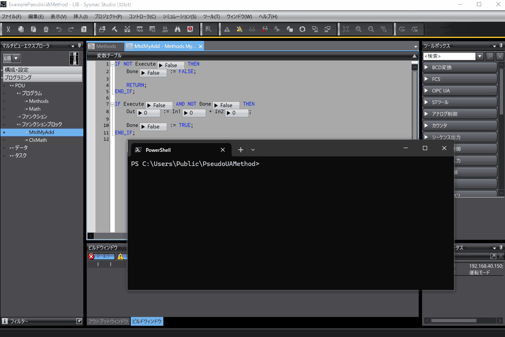

# What Is This?
This is an example of calling a function block published using the **"Variables in User-defined Function Blocks Published to OPC UA Communications"** feature of the OPC UA server of OMRON's NX and NJ controllers and Sysmac Studio as a **pseudo UA Method**.

While this example uses [`PwshOpcUaClient`](https://github.com/kmu2030/PwshOpcUaClient) as the OPC UA client, the same process can be performed with other OPC UA clients to call the function block as a pseudo-UA Method.
There's some additional information in the Japanese article, **"OPC UAで公開したファンクションブロックを疑似UA Methodとして使う"**, available at [https://zenn.dev/kitam/articles/b089617137551d](https://zenn.dev/kitam/articles/b089617137551d).

## Operating Environment
The following are required to use this example:

| Item          | Requirement |
| :------------ | :---------- |
| Controller | NX1 (Ver. 1.64 or later), NX5 (Ver. 1.64 or later), NX7 (Ver. 1.35 or later), NJ5 (Ver. 1.63 or later) |
| Sysmac Studio | Ver. 1.62 or later |
| PowerShell   | 7 or later    |

## Development Environment
This example was developed in the following environment:

| Item            | Version              |
| :-------------- | :------------------- |
| Controller     | NX102-9000 Ver. 1.64 HW Rev.A |
| Sysmac Studio | Ver. 1.63 |
| PowerShell     | 7.5.2 |

## Example Structure
The example is composed of the following:

  * **PwshOpcUaClient/**   
    This is `PwshOpcUaClient`. For usage instructions, refer to [`PwshOpcUaClient`](https://github.com/kmu2030/PwshOpcUaClient).
  * **ExamplePseudoUAMethod.ps1**   
    A PowerShell script that uses `PwshOpcUaClient` to call the published function block.
  * **ExamplePseudoUAMethod.smc2**   
    The OPC UA server-side program. This runs on the controller or the Sysmac Studio simulator.

The example script's path configuration is based on the repository's directory structure. If you change the path to `PwshOpcUaClient`, you will need to modify the part of the script that loads it.

## How to Use the Example
### Common Information
This example connects `PwshOpcUaClient` as an OPC UA client to a controller or simulator running a server-side program and an OPC UA server, and then calls a published function block.

When establishing a session or using signing (or signing and encryption) for message exchange,
the server and client may reject each other's certificates.
In both cases, once you **trust the rejected certificate**, it won't be rejected on subsequent connections.

If there are no certificate issues, perform the following steps:

  * **When PwshOpcUaClient rejects the server certificate:**   
    If the server certificate is the one you intended, move it from `PwshOpcUaClient/pki/rejected/certs` to `PwshOpcUaClient/pki/trusted/certs`.
  * **When the server rejects the client certificate:**   
    Trust the rejected certificate on the controller or simulator's OPC UA server.

By default, the example script attempts to connect to the OPC UA server with the following username and password:

| Username | Password |
|-|-|
|taker|chocolatepancakes|

### Instructions for the Simulator OPC UA Server
Here are the steps for the Sysmac Studio simulator's OPC UA server.
For more details on the simulator's OPC UA server, refer to the [manual](https://www.fa.omron.co.jp/data_pdf/mnu/w588-e1-15_nj501_nx.pdf?id=3705).

The steps are as follows:

1.  **Run `./PwshOpcUaClient/setup.ps1`**   
    This sets up `PwshOpcUaClient`.

2.  **Open the Sysmac project (`ExamplePseudoUAMethod.smc2`) in Sysmac Studio and start the simulator.**

3.  **Start and configure the simulator's OPC UA server.**   
    Operate as shown in the image below to start and configure the OPC UA server.
    

4.  **Run `./ExamplePseudoUAMethod.ps1`**   
    With the OPC UA server running, execute the following in PowerShell:

    ```powershell
    ./ExamplePseudoUAMethod.ps1 -Interval 0.01
    ```

    After connecting to the OPC UA server, the script will call the published function block `MyAdd` as shown below.
    

### Instructions for the Controller's OPC UA Server
Here are the steps for the controller's OPC UA server.
For more details on the controller's OPC UA server, refer to the [manual](https://www.fa.omron.co.jp/data_pdf/mnu/w588-e1-15_nj501_nx.pdf?id=3705).

The steps are as follows:

1.  **Run `./PwshOpcUaClient/setup.ps1`**   
    This sets up `PwshOpcUaClient`.

2.  **Open the Sysmac project (`ExamplePseudoUAMethod.smc2`) in Sysmac Studio and configure the settings to match your environment.**

3.  **Transfer the Sysmac project to the controller.**

4.  **Configure the controller's OPC UA server.**   
    Connect to the controller in Sysmac Studio and configure the OPC UA server as shown in the image below. After setting the security, you'll need to trust the `PwshOpcUaClient`'s certificate. The process shown involves a first access to get the certificate rejected, then moving it to the trusted list.
    

5.  **Run `./ExamplePseudoUAMethod.ps1`**   
    Replace `YOUR_DEVICE_ADDR` with the controller's address and execute the following in PowerShell:

    ```powershell
    ./ExamplePseudoUAMethod.ps1 -UseSimulator $false -ServerUrl YOUR_DEVICE_ADDR -Interval 0.01
    ```

    After connecting to the OPC UA server, the script will call the published function block `MyAdd` as shown below.
    

## License
The code using `PwshOpcUaClient` is licensed under **GPLv2**.
Everything else is licensed under the **MIT License**.
