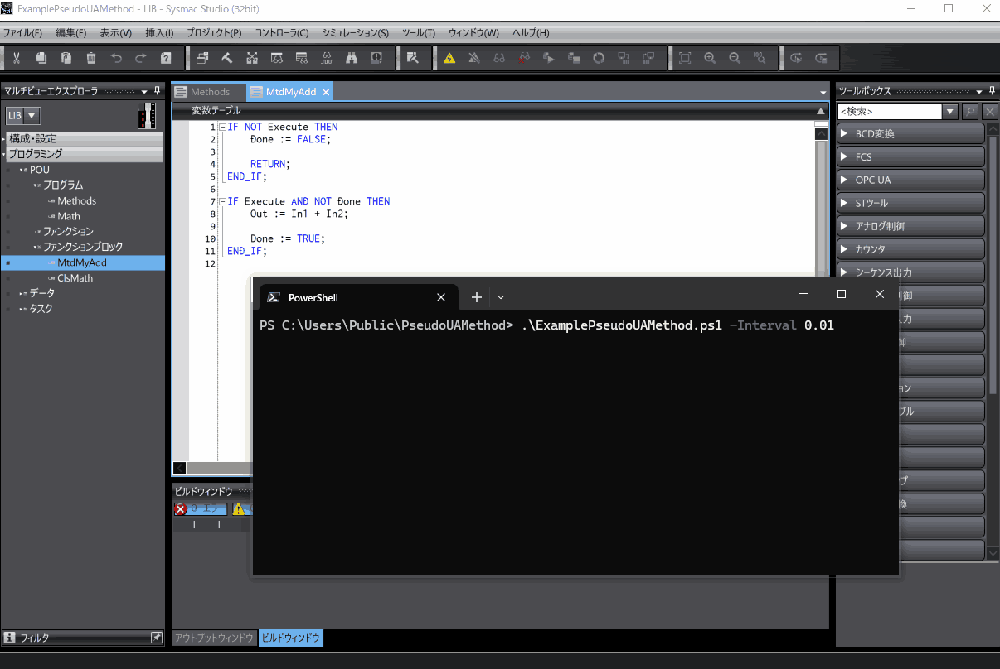

# これは何
これは、OMRON社のNX、NJコントローラ、Sysmac StudioのOPC UAサーバの **"ユーザ定義ファンクションブロックの変数の OPC UA 通信への公開"** 機能で公開したファンクションブロックを、疑似的なUA Methodとして呼び出す例示です。
OPC UAクライアントとして[`PwshOpcUaClient`](https://github.com/kmu2030/PwshOpcUaClient)を使用しますが、他のOPC UAクライアントでも同等の処理を行うことで、疑似的なUA Methodとして呼び出すことができます。
["OPC UAで公開したファンクションブロックを疑似UA Methodとして使う"](https://zenn.dev/kitam/articles/b089617137551d)に幾らか付加的な情報があります。

## 使用環境
例示の使用には、以下が必要です。

| Item          | Requirement |
| :------------ | :---------- |
| Controller | NX1(Ver.1.64以降), NX5(Ver.1.64以降), NX7(Ver.1.35以降), NJ5(Ver.1.63以降) |
| Sysmac Studio | Ver.1.62以降 |
| PowerShell   | 7以降    |

## 構築環境
例示は、以下の環境で構築しています。

| Item            | Version              |
| :-------------- | :------------------- |
| Controller     | NX102-9000 Ver.1.64 HW Rev.A |
| Sysmac Studio | Ver.1.63 |
| PowerShell     | 7.5.2 |

## 例示の構成
例示は、以下で構成します。

* **PwshOpcUaClient/**   
   `PwshOpcUaClient`です。
   使用方法は、[`PwshOpcUaClient`](https://github.com/kmu2030/PwshOpcUaClient)を参照します。
   
* **ExamplePseudoUAMethod.ps1**   
   `PwshOpcUaClient`を使用して公開ファンクションブロックの呼び出しを行うPowerShellスクリプトです。

* **ExamplePseudoUAMethod.smc2**   
   OPC UAサーバ側のプログラムです。
   コントローラ、Sysmac Studioのシミュレータで実行します。

例示スクリプトは、リポジトリのディレクトリ構造に合わせてパス構成をしています。
`PwshOpcUaClient`へのパスを変更する場合、`PwshOpcUaClient`を読み込んでいる箇所を変更します。

## 例示の使用手順
### 共通事項
例示は、サーバ側プログラムとOPC UAサーバが動作するコントローラ、シミュレータに`PwshOpcUaClient`をOPC UAクライアントとして接続し、公開ファンクションブロックの呼び出しを行います。
そのため、サーバとのセッション確立時や、メッセージ交換に署名または、署名と暗号化を使用するとサーバ、クライアントそれぞれが証明書を拒否する可能性があります。
いずれも拒否した証明書を信頼することで、次回の接続から拒否しなくなります。
証明書に問題が無ければ、以下の操作を行います。

* **PwshOpcUaClientがサーバ証明書を拒否したとき**  
   サーバ証明書が意図したものであれば、`PwshOpcUaClient/pki/rejected/certs`に格納されたサーバ証明書を`PwshOpcUaClient/pki/trusted/certs`に移動します。
* **サーバがクライアント証明書を拒否したとき**   
   コントローラ、シミュレータのOPC UAサーバで拒否した証明書を信頼します。

例示スクリプトは、デフォルトで以下のユーザーとパスワードでOPC UAサーバに接続を試みます。

| ユーザー | パスワード |
|-|-|
|taker|chocolatepancakes|

### シミュレータ用OPC UAサーバでの使用手順
Sysmac Studioのシミュレータ用OPC UAサーバでの手順を示します。
シミュレータ用OPC UAサーバの詳細は[マニュアル](https://www.fa.omron.co.jp/data_pdf/mnu/sbcd-374p_nj501_nx.pdf?id=3705)を参照してください。

手順は以下です。

1. **`./PwshOpcUaClient/setup.ps1`を実行**   
   `PwshOpcUaClient`をセットアップします。

2. **Sysmac StuidoでSysmacプロジェクト(`ExamplePseudoUAMethod.smc2`)を開きシミュレータを起動**

3. **シミュレータ用OPC UAサーバの起動と設定**   
   以下のように操作してOPC UAサーバを起動、設定します。
   

4. **`./ExamplePseudoUAMethod.ps1`を実行**   
   OPC UAサーバが起動した状態で以下をPowerShellで実行します。

   ```powershell
   ./ExamplePseudoUAMethod.ps1 -Interval 0.01
   ```

   OPC UAサーバに接続すると以下のように公開ファンクションブロックである`MyAdd`を呼び出します。
   

### コントローラのOPC UAサーバでの使用手順
コントローラのOPC UAサーバでの手順を示します。
コントローラのOPC UAサーバの詳細は[マニュアル](https://www.fa.omron.co.jp/data_pdf/mnu/sbcd-374p_nj501_nx.pdf?id=3705)を参照してください。

手順は以下です。

1. **`./PwshOpcUaClient/setup.ps1`を実行**   
   `PwshOpcUaClient`をセットアップします。

2. **Sysmac StuidoでSysmacプロジェクト(`ExamplePseudoUAMethod.smc2`)を開き構成を使用環境に合わせる**

3. **Sysmacプロジェクトをコントローラに転送**

4. **コントローラのOPC UAサーバの設定**   
   Sysmac Studioでコントローラに接続し、以下のように操作してOPC UAサーバを設定します。
   セキュリティ設定を行ったら、`PwshOpcUaClient`のクライアント証明書を信頼するために一度アクセスして拒否させた後、信頼リストに移動しています。
   

5. **`./ExamplePseudoUAMethod.ps1`の実行**   
   以下の`YOUR_DEVICE_ADDR`をコントローラのアドレスに置き換え、PowerShellで実行します。

   ```powershell
   ./ExamplePseudoUAMethod.ps1 -UseSimulator $false -ServerUrl YOUR_DEVICE_ADDR -Interval 0.01
   ```

   OPC UAサーバに接続すると以下のように公開ファンクションブロックである`MyAdd`を呼び出します。
   

## ライセンスについて
`PwshOpcUaClient`を使用したコードは、GPLv2ライセンスです。
その他は、MITライセンスです。
